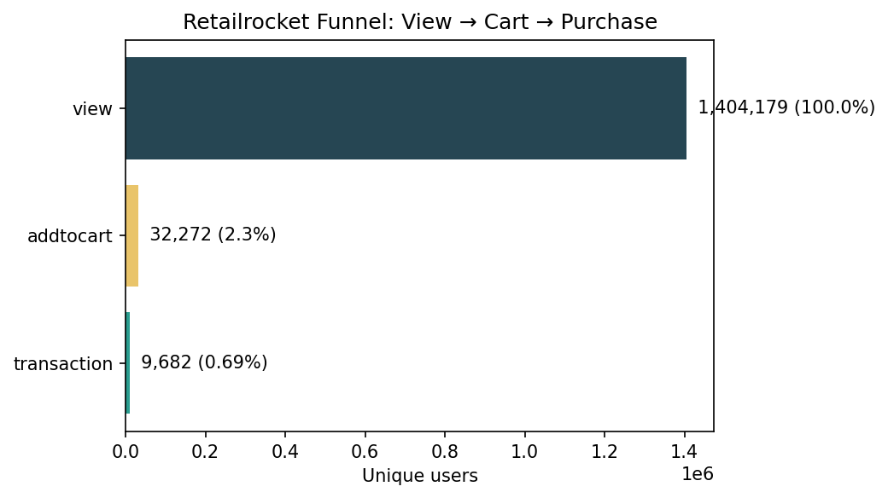
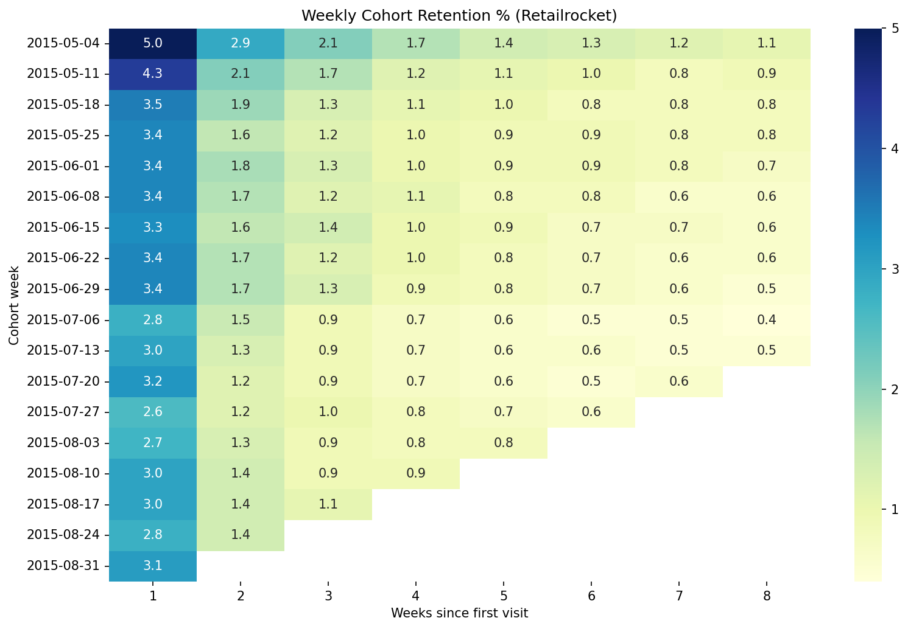

# Product Analytics Portfolio: Funnel, Cohort Retention & A/B Testing

An end-to-end product analytics project that answers three questions a product analyst deals with every day:

1. **Funnel:** Where do users drop off?
2. **Cohort retention:** Do users come back, and how fast does that fade?
3. **A/B test:** Does a product change actually work, or was it luck?

> **Note:** The two parts use two different datasets (an e-commerce store and a mobile game). This is a **methods portfolio**, not a single business story. Each part ends with its own recommendation.

---

## Project Structure

```
product-analytics-portfolio/
├── 01_funnel_cohort.ipynb      # Part 1: funnel + cohort retention (Retailrocket)
├── 02_cookiecats_abtest.ipynb  # Part 2: A/B test (Cookie Cats)
├── README.md
└── .gitignore                  # raw CSVs are not committed
```

## Datasets

| Part | Dataset | Size | Source |
|---|---|---|---|
| 1 | Retailrocket E-commerce Dataset (`events.csv`) | 2.75M events, May 3 to Sep 18, 2015 | Kaggle: `retailrocket/ecommerce-dataset` |
| 2 | Cookie Cats Mobile Games A/B Testing | 90,189 players | Kaggle: `yufengsui/mobile-games-ab-testing` |

---

## Part 1: Funnel and Cohort Retention (Retailrocket)

### 1A. Conversion Funnel

Events: `view` → `addtocart` → `transaction`, counted by unique `visitorid`.

Two versions were built:

- **Basic funnel:** unique users per event type.
- **Strict funnel:** counts a user at a step only if they reached it **in order** (view, then cart, then purchase). This is the reliable one, because some users have a cart or purchase event with no earlier view.

| Step | Basic funnel | Strict funnel | % of views (strict) | Step drop-off (strict) |
|---|---|---|---|---|
| View | 1,404,179 | 1,404,179 | 100% | n/a |
| Add to cart | 37,722 | 32,272 | 2.30% | 97.7% |
| Purchase | 11,719 | 9,682 | 0.69% | 70.0% |

**Findings**

- Overall conversion (strict) is **0.69%**.
- **View → Cart (97.7% drop)** is the largest drop, but most visitors are only browsing, so it is not the best place to intervene.
- **Cart → Purchase (70% drop)** is the most actionable leak. These users already showed buying intent.
- The basic funnel overstates conversion (0.83%) because about 5,450 users have a cart event without a preceding view.

**Recommendation:** Test a cart-abandonment reminder (email or on-site) and a simplified checkout flow, since the cart-to-purchase step is where intent is highest and the loss is largest.

<!-- Add after saving the chart:   -->

### 1B. Weekly Cohort Retention (SQL window functions)

- Cohort = the week of a user's first visit (`MIN(active_week) OVER (PARTITION BY visitorid)`).
- Retention = share of that cohort active again N weeks later.
- Written in SQL (DuckDB) using `DATE_TRUNC`, `MIN() OVER`, and `DATE_DIFF`.
- The first and last partial weeks were excluded so retention is not understated.

**Findings**

- **Week-1 retention is about 3%** for most cohorts (range roughly 2.6% to 3.4%).
- Retention decays quickly: about 1.2% to 1.9% in Week 2, and about 0.5% to 1% by Week 8.
- Cohorts from July onward look slightly weaker in Week 1 (about 2.6% to 3.2%) than June cohorts (about 3.4%). The data does not explain why, so this is noted as an observation only.
- The first cohort (May 4) shows 5.0% Week-1 retention, which is inflated (see Limitations).

<!-- Add after saving the heatmap:   -->

---

## Part 2: A/B Test (Cookie Cats)

**Experiment:** The first gate in the game was moved from level 30 (`gate_30`, control) to level 40 (`gate_40`, treatment).

**Hypotheses** (two-sided, α = 0.05)

- **H0:** Gate position has no effect on retention.
- **H1:** Gate position changes retention.

**Metrics:** Day-1 retention and Day-7 retention (primary: Day-7).

### Results

| Metric | gate_30 | gate_40 | Abs. diff | Relative lift | p-value | 95% CI (pp) |
|---|---|---|---|---|---|---|
| Day-1 retention | 44.82% | 44.23% | -0.59 pp | -1.32% | 0.0744 | (-1.24, +0.06) |
| Day-7 retention | 19.02% | 18.20% | -0.82 pp | -4.31% | **0.0016** | (-1.33, -0.31) |

- **Day-1:** not statistically significant. The confidence interval includes 0, so this is "no evidence of a difference", not "proof of no difference".
- **Day-7:** statistically significant, and the whole interval is negative. gate_40 lowers Day-7 retention. The result also holds after a Bonferroni correction for two metrics (0.05 / 2 = 0.025).

### Validation and Robustness Checks

| Check | Result |
|---|---|
| **Bootstrap** (5,000 resamples, Day-7) | 95% CI (-1.33, -0.32) pp, matching the z-test. P(gate_40 better) = 0.1% |
| **Sample Ratio Mismatch** (chi-square) | 44,700 vs 45,489 users, p = 0.0086. Mild imbalance, above the usual strict alarm threshold of p < 0.001, so the result is treated as valid but interpreted cautiously |
| **Outliers / zero-round users** | Removed 3,995 rows (3,994 users with 0 rounds + 1 user with 49,854 rounds). Day-7 diff stayed at -0.81 pp, p = 0.0026, CI (-1.34, -0.28) |
| **Engagement** (`sum_gamerounds`) | Median 17 vs 16 rounds, Mann-Whitney p = 0.0502. Borderline, so **no claim is made**. Retention is the primary metric |

### Recommendation

**Keep the gate at level 30.** Moving it to level 40 reduced Day-7 retention by about 0.8 percentage points (about 4.3% relative), a result confirmed by a z-test, a bootstrap, and a cleaned-data re-test. A possible explanation is that delaying the gate reduces the "forced pause" that brings players back, but this is a hypothesis; the data does not test it.

---

## Limitations

- **Retailrocket `visitorid` is cookie-based**, so one person on several devices counts as several visitors. Funnel and retention numbers are therefore approximate.
- **First cohort (May 4) is inflated.** The data starts on May 3, so returning users in the first week are counted as new.
- **No revenue or price data** in Retailrocket, so the funnel measures conversion, not value.
- **Cookie Cats shows mild SRM** (p = 0.0086), so randomization is not perfectly clean.
- **Cookie Cats retention is observational on a single test.** It does not show long-term effects beyond Day-7, and the lack of significance on Day-1 and engagement should not be read as "no effect".
- **Two unrelated domains.** The funnel/cohort and the A/B test come from different businesses, so the project demonstrates techniques rather than one combined story.

## Tech Stack

- **Python:** Pandas, NumPy
- **SQL:** DuckDB (window functions: `MIN() OVER`, `DATE_TRUNC`, `DATE_DIFF`)
- **Statistics:** statsmodels (two-proportion z-test, confidence intervals), SciPy (chi-square, Mann-Whitney U), bootstrap resampling
- **Visualization:** Matplotlib, Seaborn
- **Tools:** Jupyter Notebook, VS Code, Git

## How to Run

```bash
git clone https://github.com/Nisha2025-droid/product-analytics-portfolio.git
cd product-analytics-portfolio
pip install pandas numpy scipy statsmodels matplotlib seaborn duckdb ipykernel
```

1. Download the two datasets from Kaggle (links above) and place `events.csv` and `cookie_cats.csv` in the project folder.
2. Open `01_funnel_cohort.ipynb` and `02_cookiecats_abtest.ipynb` in Jupyter or VS Code and run all cells.

## Author

**Nisha**
GitHub: [Nisha2025-droid](https://github.com/Nisha2025-droid) | LinkedIn: [nisha-sah](https://linkedin.com/in/nisha-sah-44ba23301/) | Email: nishasah.work@gmail.com